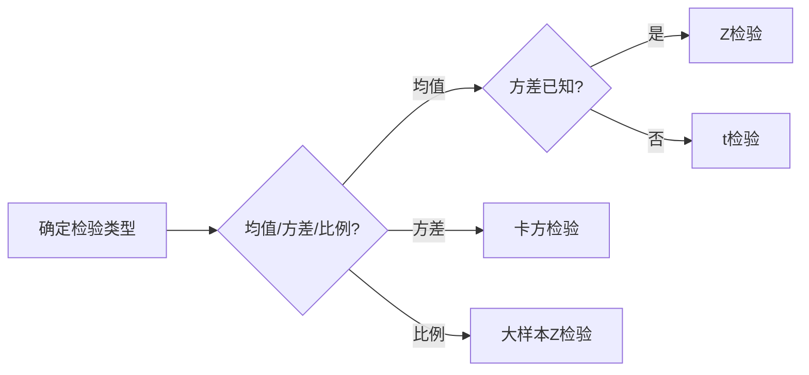

单总体假设检验是通过样本数据推断总体参数是否满足某种假设的统计方法，核心步骤包括建立假设、选择检验统计量、确定显著性水平、计算统计量值并决策。以下是常见的单总体假设检验类型及步骤（以正态总体为主）：

### **一、单总体均值的假设检验**
#### **1. 正态总体，方差已知（$ Z  $检验）**
**适用条件**：  
- 总体服从正态分布 $ N(\mu, \sigma^2) $，且方差 $ \sigma^2 $ 已知；  
- 若总体非正态，但样本量 $n \geq 30 $（中心极限定理近似）。  

**步骤**：  

1. **建立假设**：  
   - 双侧检验：$H_0: \mu = \mu_0 $ vs $H_1: \mu \neq \mu_0 $
   - 单侧检验（左尾）：$H_0: \mu \geq \mu_0 $ vs $ H_1: \mu < \mu_0 $
   - 单侧检验（右尾）：$H_0: \mu \leq \mu_0 $ vs $ H_1: \mu > \mu_0 $
2. **检验统计量**：  
   $
   Z = \frac{\bar{X} - \mu_0}{\sigma / \sqrt{n}} \sim N(0, 1)
   $
   其中 $\bar{X} $为样本均值，$ \mu_0 $为假设的总体均值，$ n $ 为样本量。  
3. **确定拒绝域**（显著性水平 $ \alpha $）：  
   - 双侧：$|Z| > Z_{\alpha/2}$
   - 左尾：$ Z < -Z_{\alpha} $
   - 右尾：$ Z > Z_{\alpha} $
   $( Z_{\alpha} $为标准正态分布的上 $ \alpha$ 分位数，如 $ \alpha = 0.05 $时，$ Z_{0.025} = 1.96 $）。  
4. **计算统计量并决策**：若统计量落入拒绝域，则拒绝 $ H_0$，否则不拒绝。  

**例**：某工厂生产零件，已知直径服从正态分布$ N(\mu, 0.09)$，原均值 $ \mu_0 = 10 $ mm。现抽取$ n = 25 $个样本，测得$ \bar{X} = 10.1 $ mm，检验均值是否变化（$\alpha = 0.05$）。  
- 计算：$ Z = \frac{10.1 - 10}{0.3 / \sqrt{25}} \approx 1.67 $
- 拒绝域：$|Z| > 1.96$，因 $1.67 < 1.96 $，不拒绝 $ H_0 $，即均值无显著变化。

#### **2. 正态总体，方差未知（$t $ 检验）**
**适用条件**：  
- 总体服从正态分布 $ N(\mu, \sigma^2) $，但方差$ \sigma^2 $ 未知，用样本方差$ S^2 $ 估计。  

**步骤**：  
1. **建立假设**：同$ Z $检验。  
2. **检验统计量**：  
   $
   t = \frac{\bar{X} - \mu_0}{S / \sqrt{n}} \sim t(n-1)
   $
   其中 $ S = \sqrt{\frac{1}{n-1}\sum_{i=1}^n (X_i - \bar{X})^2} $ 为样本标准差，自由度 $ df = n-1$。  
3. **拒绝域**：  
   - 双侧：$|t| > t_{\alpha/2}(n-1) $
   - 单侧：$ t < -t_{\alpha}(n-1) $或$ t > t_{\alpha}(n-1)$
   （如$\alpha = 0.05 $，$ n = 10 $ 时，$ t_{0.025}(9) = 2.262$）。  
4. **计算与决策**：同上。  

**例**：某班级数学成绩均值假设为 80 分，抽取 $n = 16 $人，测得 $ \bar{X} = 85 $，$S = 6 $，检验均值是否高于 80（$ \alpha = 0.05$）。  

- 计算：$t = \frac{85 - 80}{6 / \sqrt{16}} \approx 3.33 $
- 拒绝域：$t > 1.753 $ ，$ t_{0.05}(15) = 1.753 $，因 $ 3.33 > 1.753$，拒绝 $ H_0 $，即均值显著高于 80。

### **二、单总体方差的假设检验（$\chi^2 $检验）**
**适用条件**：总体服从正态分布$ N(\mu, \sigma^2)$，检验方差 $$ \sigma^2 $ 是否等于某值$\sigma_0^2 $。  

**步骤**：  
1. **建立假设**：  
   - 双侧：$ H_0: \sigma^2 = \sigma_0^2$ vs$H_1: \sigma^2 \neq \sigma_0^2 $
   - 单侧：$H_0: \sigma^2 \leq \sigma_0^2 $ vs $H_1: \sigma^2 > \sigma_0^2 $（或左尾）。  
2. **检验统计量**：  
   $
   \chi^2 = \frac{(n-1)S^2}{\sigma_0^2} \sim \chi^2(n-1)
   $
   自由度 $df = n-1 $。  
3. **拒绝域**：  
   - 双侧：$\chi^2 < \chi_{1-\alpha/2}^2(n-1) $ 或 $ \chi^2 > \chi_{\alpha/2}^2(n-1) $
   - 右尾：$\chi^2 > \chi_{\alpha}^2(n-1) $
   - 左尾：$ \chi^2 < \chi_{1-\alpha}^2(n-1)$
   （如$ \alpha = 0.05 $，$n = 10$ 时，双侧临界值为$ \chi_{0.975}^2(9) = 2.700$ 和 $\chi_{0.025}^2(9) = 19.023 $）。  
4. **计算与决策**：同上。  

**例**：某生产线零件方差原假设为 $\sigma_0^2 = 4 $，抽取 $ n = 25 $ 个样本，测得 $S^2 = 6 $，检验方差是否变大$( \alpha = 0.05 $）。  
- 计算：$\chi^2 = \frac{24 \times 6}{4} = 36 $ 
- 拒绝域：$ \chi^2 > \chi_{0.05}^2(24) = 36.415 $，因 $ 36 < 36.415 $，不拒绝$ H_0 $，即方差未显著变大。

### **三、单总体比例的假设检验（大样本$ Z $检验）**
**适用条件**：  
- 总体服从二项分布 $B(n, p) $，检验比例 v p $ 是否等于某值$ p_0 $；  
- 大样本条件：$np_0 \geq 5$且$ n(1-p_0) \geq 5 $。  

**步骤**：  
1. **建立假设**：  
   - 双侧：$ H_0: p = p_0  $ vs $ H_1: p \neq p_0 $
   - 单侧：类似均值检验。  
2. **检验统计量**：  
   $
   Z = \frac{\hat{p} - p_0}{\sqrt{\frac{p_0(1-p_0)}{n}}} \sim N(0, 1)
   $
   其中 $\hat{p} = \frac{X}{n} $ 为样本比例，$ X $ 为成功次数。  
3. **拒绝域**：同均值$Z$检验。  
4. **计算与决策**：同上。  

**例**：某产品次品率原假设为$ p_0 = 0.1$，抽取$n = 200$ 件，发现 25 件次品，检验次品率是否上升$( \alpha = 0.05$）。  
- 计算：$\hat{p} = 25/200 = 0.125 $，$Z = \frac{0.125 - 0.1}{\sqrt{0.1 \times 0.9 / 200}} \approx 1.39$
- 拒绝域：$Z > 1.645 $（右尾），因$ 1.39 < 1.645 $，不拒绝 $ H_0 $，即次品率未显著上升。

### **四、假设检验的核心概念**
1. **两类错误**：  
   - **Ⅰ型错误（弃真）**：拒绝真实的 $ H_0 $，概率为 $ \alpha$（显著性水平）。  
   - **Ⅱ型错误（纳伪）**：接受错误的 $H_0$，概率为 $ \beta $，与样本量、真实差异等有关。  
2. **显著性水平 $ \alpha $**：通常取$0.05 $或 $ 0.01 $，表示允许犯Ⅰ型错误的最大概率。  
3. **$p $-值**：若$ p $-值 < $ \alpha $，则拒绝 $ H_0$（如 $ p $-值 = 0.03 < 0.05 时拒绝）。  

### **总结：单总体假设检验流程图**

根据总体分布、已知参数及样本量选择合适的检验方法，按步骤计算统计量并决策即可完成单总体假设检验。